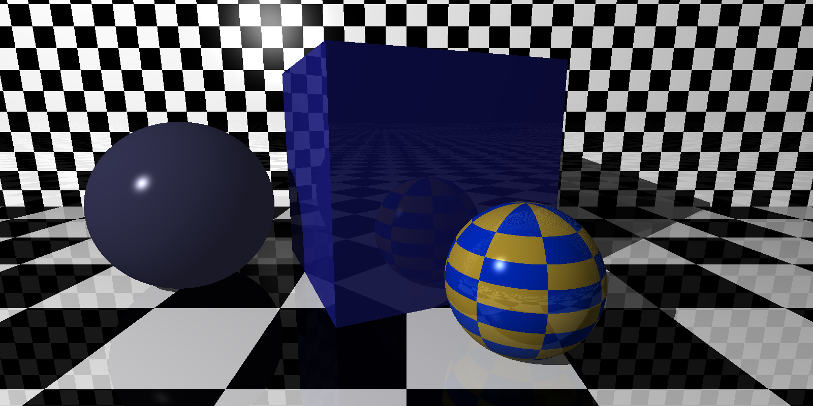
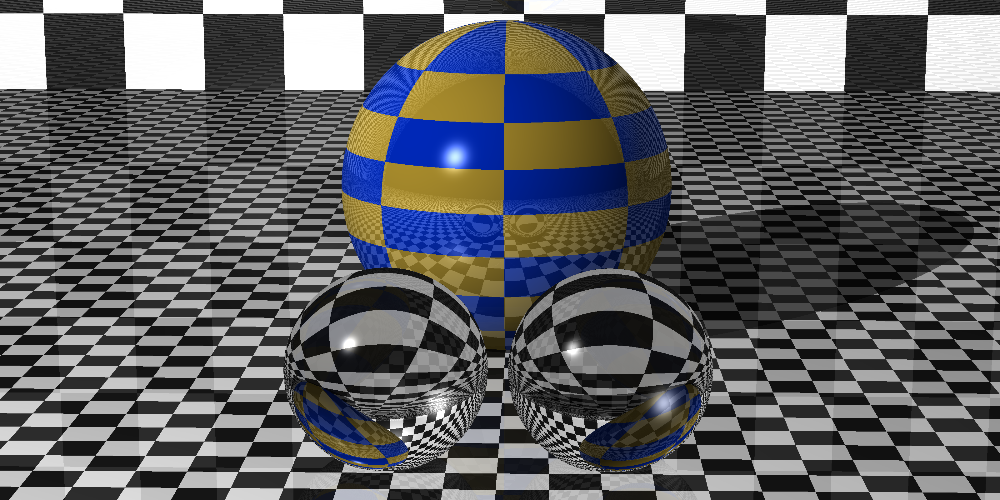
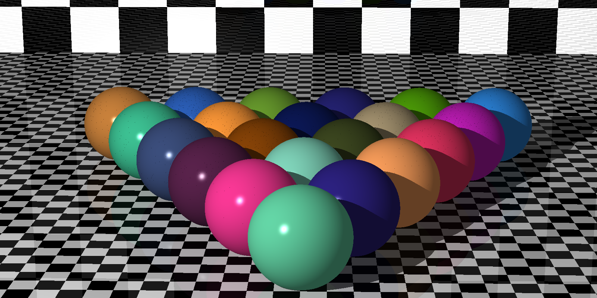

# Ray tracing from first principles
This repo contains a c++ code base for rendering 3D scenes using ray tracing. All the code was written from scratch and no external libraries were used apart from cppunit for creating unit tests. Below are some example images showcaseing what the code can do:







# Rendering the examples
The examples can only be run on Linux and require gcc and make to be installed.

To run them, execute:
```
make
```
from within the examples directory at the top level of the project. This will create and run 3 separate executables corresponding to the 3 cpp files in that directory but do note that this will take a while (about a minute on my machine but the time will vary based on your system). a ppm file for each example will be created which should be readable by most image viewers/editors.

# Implementation details
The code uses the [Phong reflection model](https://en.wikipedia.org/wiki/Phong_reflection_model) along with an implementation of a pinhole camera to render the scene. The only available lightsource is a point light with a definable colour.

Currently, the only shapes available are spheres and cuboids and the surface of these can either be a checker pattern or a block colour.